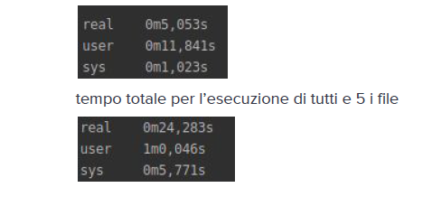

# Progetto-calcolatori-elettronici
Matteo Cardano & Stefano Lavaggi
4324904, 4373205
Università di Genova - Scuola Politecnica
# Progetto di Calcolatori Elettronici
PANORAMICA
Report dell’esecuzione e del funzionamento del progetto definito durante le lezioni di Calcolatori
Elettronici. Si rimanda al link delle specifiche richieste:
https://docs.google.com/document/d/1ikbfA4v9-FQhoQm40FjaT2b5x5MV3h2OvMWFQS1SrFs/edit
per l’utilizzo dei codici di errore di linux abbiamo utilizzato questo sito come fonte
https://android.googlesource.com/platform/prebuilts/gcc/linux-x86/host/x86_64-linux-glibc2.7-4.6/+/jb-dev/
sysroot/usr/include/sysexits.h
per scrivere il make file abbiamo utilizzato Guida trovata :
http://www.bo.cnr.it/corsi-di-informatica/corsoCstandard/Lezioni/17Linuxmake.html
OBIETTIVI
1. Realizzazione di uno Scheduler con preemption
2. Realizzazione di uno Scheduler senza preemption
3. Utilizzo del Multithreading
SPECIFICHE
Abbiamo deciso di strutturare il codice in più cartelle, contenenti i vari file .c e .h , per facilitare la
realizzazione del progetto e renderlo maggiormente leggibile e comprensibile evitando così file
con troppe righe di codice trattanti elementi differenti.
STRUTTURE DATI
Per la realizzazione del progetto abbiamo deciso di sfruttare una lista semplicemente
concatenata nella quali inseriamo i valori dei dati letti da file , due liste semplicemente
concatenate per tenere traccia dei processi ready e blocked e per ottimizzare al meglio il
funzionamento dell'algoritmo Round Robin, un ulteriore lista (denominata coda) per tenere
traccia della coda d' esecuzione. Abbiamo fatto ricadere la nostra scelta su questa tipologia di
liste perchè risultano ideali per i 2 algoritmi scelti per schedulare. Tutte le liste sono dotate degli
attributi minimi richiesti ma in aggiunta contengono attributi utili e specifici al nostro progetto a tal
fine di migliorare il tutto.
Per ottimizzare al meglio e soprattutto semplificare l'inserimento degli elementi nelle varie liste
nelle dovute posizioni abbiamo sfruttato la definizione di un’opportuna struttura. La quale
permette di tenere traccia in qualsiasi frangente sia dell'inizio che della fine della lista , il che
consente di velocizzare l'inserimento in coda dei vari elementi , evitando la ricerca di questi ultimi
percorrendola tutta. La quale operazione sarebbe risultata troppo dispendiosa dal punto di vista
del tempo al punto di non rispettare il parametro indicato e richiesto dal progetto.
ALGORITMI
Gli algoritmi scelti e utilizzati per la schedulazione sono FCFS e ROUND ROBIN , i quali offrono un
buon rapporto tra complessità d'implementazione e prestazioni , la scelta del quanto di tempo è
stata fatta tramite opportuni test e prove di comparazione .
A livello di prestazioni l’algoritmo più performante risulta FCFS , ma questo in casi sfavorevoli (
una sequenza d’istruzioni non bloccanti occupanti molti cicli di clock) genera il fenomeno della
“starvation” , ovvero la presenza di processi in stato READY che attendono la schedulazione. Lo
svantaggio prestazionale del Round-Robin viene ripagato da una politica di schedulazione
cosiddetta “ fear” .
EVOLUZIONE ESECUZIONE
All’ interno della funzione MAIN si leggono i file e viene riempita la nostra struttura dati LISTA
con ciò che è stato letto nel file di input. Questa assieme ad altri attributi sarà argomento dello
Scheduler. Sempre nel MAIN sono state effettuate la fork() e la creazione del thread,
permettendo la simulazione del sistema richiesto nelle specifiche di progetto.
Nella funzione SCHEDULER partiamo con la creazione delle due liste ausiliarie READY e
BLOCKED e utilizzando il “Five-State Process Model” aggiorniamo periodicamente i tasks in
READY , selezioniamo a seconda del caso (Preemption o no) l’ oppurtuno task da eseguire
passando all’esecuzione delle istruzioni contenuto in esso. Qui in base allo stato di esecuzione e
alla tipologia decidiamo se occorre aggiornare lo stato del tasks ed eventualmente inserirlo in
una lista di gestione (precedentemente create), in caso di istruzione bloccante generiamo un
numero compreso tra 0 e lunghezza (estremi esclusi) ed inseriamo quest’ultima nella lista
BLOCKED. Va ricordato che ad ogni aggiornamento di stato l’ evento viene registrato nei file
richiesti.
Tutte le ulteriori utility contengono niente meno che gli algoritmi di Scheduling, le funzione per la
gestione delle strutture dati, e i metodi per lettura da terminale e scrittura su console.
Quest’ultime sono state create per fornire i comandi richiesti.
Tramite il comando make all viene generato l’eseguibile denominato simulator ( come
esplicitamente richiesto) e in più abbiamo aggiunto il comando make test che esegue in
automatico lo scheduling di tutti e 5 i file test in modo sequenziale.
Infine si può anche utilizzare il comando make clean per eliminare tutto ciò che è stato creato per
l’ esecuzione dell’ intero simulator.
ANALISI PRESTAZIONALE
Il programma è stato scritto e testato su sistema Linux Ubuntu 18.04 LTS dotato del seguente
hardware:
Intel core i3-4005U , dual-core , 1.7 GHz

La velocità d'esecuzione soddisfa i canoni imposti ( 180 secondi massimo).
